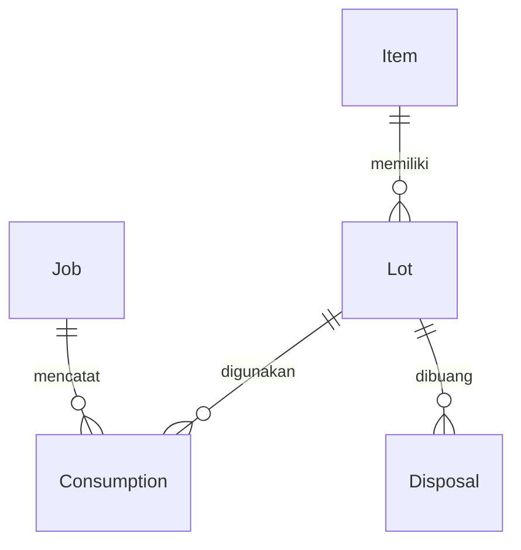

# Software Requirements Specification

## 1. Tujuan dan petunjuk untuk AI agent

Dokumen ini mengubah PRD Lab Consumable Expiry Tracker v1.0 menjadi spesifikasi implementasi yang terstruktur dan dapat diuji. Produk mengelola bahan laboratorium pada tingkat Lot, mencegah konsumsi bahan tidak eligible, menggunakan FEFO, dan menjaga integritas stok serta audit.

### 1.1 Konvensi normatif

- **MUST / MUST NOT**: persyaratan wajib atau larangan.
- **SHOULD**: rekomendasi yang dapat diubah dengan alasan terdokumentasi.
- **MAY**: pilihan opsional dalam scope yang telah disetujui.
- **SOURCE**: berasal dari PRD; tetap berstatus draft mengikuti sumber.
- **DERIVED**: penjabaran teknis untuk memenuhi PRD, bukan kutipan keputusan produk.
- **PROPOSED**: keputusan tambahan yang belum dikunci oleh PRD; jangan diperlakukan sebagai persetujuan stakeholder.
- **OPEN**: belum ditentukan. Lihat daftar keputusan pada bagian 12.

Prioritas `Must`, `Should`, dan `Nice` mengikuti MoSCoW pada PRD. Kata MUST dalam bagian PROPOSED berlaku setelah proposal terkait disetujui.

### 1.2 Kontrak kerja agent

1. Agent MUST membaca seluruh dokumen sebelum mengubah domain atau persistence.
2. Agent MUST mempertahankan model kanonis pada bagian 4 dan invariant pada bagian 5.
3. Agent MUST menggunakan ID requirement dan acceptance test dalam laporan implementasi agar perubahan dapat ditelusuri.
4. Agent MUST menggunakan Lot sebagai unit inventaris terkecil langsung di bawah Item. Seluruh identitas, kuantitas, expiry, status administratif, dan lokasi penyimpanan berada pada Lot; agent MUST NOT menambahkan lapisan inventaris di bawah Lot atau operasi pemecahan Lot.
5. Agent MUST NOT menyamakan `AdministrativeStatus`, `ExpiryCondition`, dan `IsLowStock` menjadi satu enum.
6. Agent MUST NOT menganggap rekomendasi FEFO sebagai reservasi atau jaminan kelayakan saat konsumsi nanti.
7. Agent MUST NOT menetapkan keputusan OPEN secara diam-diam. Kerjakan bagian independen terlebih dahulu; catat keputusan teknis sementara sebagai PROPOSED dan isolasi ketergantungannya.
8. Jika implementasi memerlukan perubahan Item-Lot, eligibility, FEFO, atau transaction boundary, agent MUST mengajukan perubahan spesifikasi beserta dampak pada acceptance test.
9. Jika dokumen ini bertentangan dengan PRD, agent MUST melaporkan konflik, bukan mengganti kontrak sumber diam-diam. Instruksi eksplisit terbaru dari pemilik produk menjadi perubahan yang harus dicatat.
10. Agent MUST NOT mengklaim fitur selesai hanya karena build berhasil; verifikasi acceptance criteria yang relevan.

### 1.3 Dasar sumber

Rujukan `PRD §x, p.y` merujuk nomor bagian dan halaman tercetak pada PDF sumber. Revisi 1.2.0 telah membaca lampiran `skill(1).md` (skill `lab-consumable-expiry-tracker`) sebagai panduan implementasi. Struktur direktori dan stack yang diberikan pemilik produk pada 2026-09-10 menjadi keputusan eksplisit terbaru. PDF sumber dan `diagram.mmd` tidak disertakan untuk revisi ini; rujukan halaman PRD dipertahankan dari SRS sebelumnya, bukan hasil verifikasi ulang kedua berkas tersebut.

## 2. Scope dan aktor

### 2.1 Scope MVP

| Fitur | Prioritas | Cakupan |
| --- | --- | --- |
| F-01 | Must | Registrasi Item dan Lot langsung di bawah Item |
| F-02 | Must | Evaluasi Valid, ExpiringSoon, Expired dan eligibility |
| F-03 | Must | Remaining quantity, usable stock, low stock, ringkasan status |
| F-04 | Must | Job Draft, InProgress, Completed, Cancelled |
| F-05 | Must | Alokasi FEFO satu atau beberapa Lot |
| F-06 | Must | Konsumsi parsial/penuh dan Consumption atomik |
| F-07 | Must | Disposal, manual block, quarantine |
| F-08 | Must | Penelusuran Consumption dan Disposal |
| F-09 | Should | Quick actions dari alert dashboard |
| F-10 | Nice | Ekspor/integrasi; ditunda dari MVP sampai disepakati |

Sumber: PRD §4-6, p.3-6.

Di luar MVP: purchase order, supplier management, keuangan, warehouse hierarchy, lot splitting, geofencing, data medis pasien, integrasi otomatis alat laboratorium/ERP, dan kanal email/push. Jangan membuat fitur tersebut sebagai dependensi alur inti.

### 2.2 Pengguna dan hak akses

Sistem MVP MUST memiliki tepat dua role aplikasi. Gunakan nama kanonis berikut pada authorization policy dan enum/constant aplikasi:

```text
LabOperator
WarehouseAdmin
```

Nama tampilan masing-masing adalah **Lab Operator** dan **Admin Gudang**. Product Owner, Engineering, QA, DevOps, Lab Manager, dan Procurement tetap dapat menjadi stakeholder proses bisnis, tetapi bukan role login aplikasi MVP.

| Kemampuan | Lab Operator | Admin Gudang |
| --- | :---: | :---: |
| Login dan melihat profil sendiri | Ya | Ya |
| Melihat dashboard, Item, Lot, status expiry, usable stock, dan low stock | Ya | Ya |
| Membuat, mengubah, dan menonaktifkan master Item | Tidak | Ya |
| Mendaftarkan dan memperbarui data administratif Lot | Tidak | Ya |
| Membuat, memulai, menyelesaikan, dan membatalkan Job sesuai lifecycle | Ya | Tidak |
| Meminta rekomendasi FEFO | Ya | Tidak |
| Mengonfirmasi Consumption untuk Job | Ya | Tidak |
| Mencatat Disposal | Tidak | Ya |
| Block, quarantine, dan release Lot sesuai transisi yang disetujui | Tidak | Ya |
| Melihat seluruh riwayat Consumption dan Disposal | Ya | Ya |
| Mengelola akun atau mengganti role pengguna | Tidak ditetapkan dalam MVP | Tidak ditetapkan dalam MVP |

**RBAC-01 — Keputusan produk 2026-09-09, Must.** Server MUST menegakkan matriks di atas pada setiap command dan query terkait. Menyembunyikan tombol di UI tidak cukup. Akun yang terautentikasi tetapi tidak memiliki salah satu dari dua role ditolak. Pengguna tidak boleh menaikkan role sendiri atau mengirim `ConsumedBy`/`DisposedBy` sebagai identitas otoritatif.

**RBAC-02 — Derived, Must.** Admin Gudang mengelola persediaan dan status Lot; Lab Operator menjalankan Job serta Consumption. Jika organisasi membutuhkan satu orang menjalankan kedua tanggung jawab, akun tersebut MAY diberi kedua role selama penyedia identitas mendukung multi-role. Hal ini tidak membuat role ketiga.

Sumber persona awal: PRD §3, p.3. Pembatasan menjadi dua role dan matriks di atas merupakan keputusan terbaru pemilik produk dan menggantikan bagian role PRD yang masih terbuka.

## 3. Konteks sistem dan arsitektur

### 3.1 Stack dan batas tanggung jawab

**NFR-ARCH-01 — SOURCE + keputusan struktur 2026-09-10, Must.** Pertahankan arah dependensi Clean Architecture dalam susunan folder backend pada §3.2. Domain dan application use case MUST NOT bergantung pada implementasi EF Core, Identity, atau UI. Struktur ini merupakan organisasi folder dalam proyek Web API; pemisahan assembly Domain/Application/Infrastructure tidak diwajibkan oleh perubahan ini. Folder saja tidak membuktikan isolasi dependensi: tanggung jawab dan referensi kode harus tetap diperiksa.

**NFR-ARCH-02 — SOURCE + keputusan pemilik produk 2026-09-10, Must.** Backend menggunakan ASP.NET Core Web API pada .NET 8, frontend React, database PostgreSQL, ORM Entity Framework Core, manajemen pengguna ASP.NET Core Identity, dan autentikasi JWT Bearer. Gunakan Repository Pattern, Dependency Injection, DTO, AutoMapper, dan FluentValidation sesuai struktur yang ditetapkan. Referensi inventaris menggunakan `LotId`. Pemilihan versi paket yang kompatibel dan konfigurasi deployment ditetapkan saat implementasi; revisi ini tidak mengubah target .NET 8 dari skill.

**NFR-TIME-01 — SOURCE, Must.** Application mengambil waktu keputusan melalui `TimeProvider.GetUtcNow()` lalu memberikan nilai `now` ke domain. Domain MUST NOT membaca jam sistem secara langsung. Waktu disimpan/dibandingkan dalam UTC; konversi tampilan lokal dilakukan pada boundary UI.

**NFR-PERSIST-01 — SOURCE, Must.** `IUnitOfWork.SaveChangesAsync()` mengcommit perubahan stok dan record Consumption/Disposal secara atomik. PostgreSQL + EF Core telah ditetapkan pemilik produk. Mapping RowVersion dan kebijakan migrasi deployment masih harus diselesaikan pada D-03; pemilihan database tidak lagi OPEN.

Pembagian tanggung jawab berikut **DERIVED**:

| Lapisan | Tanggung jawab |
| --- | --- |
| Domain | Item, Lot, Job, Consumption, Disposal, LotAllocation, aturan eligibility dan FEFO |
| Application | Use case, otorisasi melalui abstraction, waktu, repository interfaces, UoW, validasi command |
| Infrastructure | Implementasi repository/UoW, mapping database, concurrency, identity adapter, logging |
| Presentation | Transport/API/UI, validasi bentuk input, tampilan dan pemetaan error |

Sumber: PRD §8-9, p.8-9; keputusan struktur dan stack pemilik produk 2026-09-10.

### 3.2 Struktur direktori backend yang ditetapkan

**NFR-DIR-01 — Keputusan pemilik produk 2026-09-10, Must.** Gunakan penempatan berikut sebagai baseline backend `LabConsumableExpiryTracker/`. Diagram direktori ini adalah spesifikasi penempatan, bukan pernyataan bahwa file atau implementasinya telah dibuat. Proyek React berada terpisah dari folder backend; nama folder dan struktur internal frontend belum ditetapkan.

```text
LabConsumableExpiryTracker/
├── Common/
│   └── Results/
│       └── ServiceResult.cs
├── Configurations/
│   └── JwtSettings.cs
├── Controllers/
│   ├── AuthController.cs
│   └── LotController.cs
├── Data/
│   ├── Interfaces/
│   │   └── IDbInitializer.cs
│   ├── AppDbContext.cs
│   ├── DbInitializer.cs
│   └── UserSeeder.cs
├── DTOs/
│   ├── Auth/
│   │   ├── AuthResponseDto.cs
│   │   ├── CreateScientistRequestDto.cs
│   │   ├── LoginRequestDto.cs
│   │   ├── ScientistResponseDto.cs
│   │   └── UpdateScientistRequestDto.cs
│   └── Lots/
├── Mapping/
│   └── MappingProfile.cs
├── Migrations/
├── Models/
│   ├── Enums/
│   │   ├── ExpiryCondition.cs
│   │   ├── JobStatus.cs
│   │   ├── LotAdministrativeStatus.cs
│   │   ├── UnitOfMeasure.cs
│   │   └── UserRole.cs
│   ├── Consumption.cs
│   ├── Disposal.cs
│   ├── Item.cs
│   ├── Job.cs
│   ├── Lot.cs
│   └── User.cs
├── Repositories/
│   ├── Interfaces/
│   │   ├── ILotRepository.cs
│   │   └── IUnitOfWork.cs
│   └── LotRepository.cs
├── Services/
│   ├── Interfaces/
│   │   └── IIdentityService.cs
│   └── IdentityService.cs
└── Validators/
    └── Auth/
        ├── CreateScientistRequestValidator.cs
        ├── LoginRequestValidator.cs
        └── UpdateScientistRequestValidator.cs
```

### 3.3 Kontrak penempatan dan dependensi

Seluruh path tabel berikut relatif terhadap direktori backend pada §3.2.

| Direktori / file | Tanggung jawab | Batas wajib |
| --- | --- | --- |
| `Common/Results/ServiceResult.cs` | Wrapper keberhasilan, data, dan kode/keterangan kegagalan use case | Bebas EF Core, Identity, dan tipe respons HTTP; controller memetakan hasil ke HTTP §7.1 |
| `Configurations/JwtSettings.cs` | Konfigurasi issuer, audience, masa berlaku, dan pengaturan penandatanganan JWT | Secret berasal dari konfigurasi aman environment/deployment; jangan hardcode atau commit secret |
| `Controllers/AuthController.cs` | HTTP login dan operasi identitas yang diizinkan | Memanggil IIdentityService; tidak memeriksa password atau menerbitkan token sendiri |
| `Controllers/LotController.cs` | HTTP untuk query/command Lot sesuai use case dan RBAC | Memanggil abstraction service; tidak mengakses AppDbContext atau menjalankan FEFO/pengurangan stok langsung |
| `Data/Interfaces/IDbInitializer.cs` | Kontrak inisialisasi persistence | Kontrak infrastructure, bukan dependensi domain |
| `Data/AppDbContext.cs` | Persistence EF Core untuk entitas inventaris dan Identity | Relasi, precision, constraint, concurrency dan mapping disiapkan di persistence; domain tidak menerima DbContext |
| `Data/DbInitializer.cs` | Orkestrasi persiapan database dan seeding | Ikuti kebijakan deployment; jangan reset database atau menghapus data untuk inisialisasi rutin |
| `Data/UserSeeder.cs` | Seed role dan akun awal melalui fasilitas Identity | Idempotent; role hanya LabOperator/WarehouseAdmin; tanpa password default yang ditanam di source |
| `DTOs/Auth/` | Input/output login dan operasi akun yang sudah disetujui | Response tidak memuat password/hash/security stamp; penamaan Scientist tidak menambah role |
| `DTOs/Lots/` | DTO domain consumable, termasuk create/read/update Lot dan command stok | Referensi LotId; expected RowVersion untuk mutasi relevan; quantity tidak diedit langsung melalui generic CRUD |
| `Mapping/MappingProfile.cs` | AutoMapper entity–DTO dan pemetaan field yang diizinkan | Hindari overwrite Id, InitialQuantity, RemainingQuantity, actor, token versi, dan status melalui mapping request bebas |
| `Migrations/` | Riwayat perubahan schema PostgreSQL yang dihasilkan EF Core | Mempertahankan relasi Item–Lot dan histori audit; stok dan expiry tersimpan langsung pada tabel Lot |
| `Models/` selain User | Entitas domain dan aturan bisnis murni | Tidak mengakses EF Core, Identity, HttpContext, React, atau jam sistem langsung |
| `Models/User.cs` | Model pengguna persistence yang terintegrasi ASP.NET Core Identity | Secara logis infrastructure walaupun berada dalam Models; entitas inventaris tidak bergantung pada model Identity ini |
| `Models/Enums/` | Unit, lifecycle Job, kondisi expiry, status administratif, dan nama role | Status expiry dan low stock tetap terpisah dari status administratif |
| `Repositories/Interfaces/ILotRepository.cs` | Kontrak GetCandidatesAsync(itemId), GetByIdAsync(id), AddAsync(lot) | Tidak membocorkan DbSet, DbContext, atau query provider EF ke application |
| `Repositories/Interfaces/IUnitOfWork.cs` | Kontrak SaveChangesAsync untuk commit atomik | Seluruh stok dan audit satu command memakai unit transaksi yang sama |
| `Repositories/LotRepository.cs` | LINQ EF Core untuk membaca/menulis Lot | Query dan tracking berada di repository; tidak menggantikan validasi domain, tidak commit mandiri per Lot |
| `Services/Interfaces/IIdentityService.cs` | Abstraction login dan use case identitas | Signature menggunakan DTO/hasil aplikasi, tidak membocorkan tipe implementation Identity |
| `Services/IdentityService.cs` | Adapter ASP.NET Core Identity, verifikasi kredensial, role, dan penerbitan JWT | Secara logis infrastructure; gunakan fasilitas Identity untuk password/akun, tanpa menyimpan password mentah |
| `Services/` untuk use case inventaris | Orkestrasi otorisasi, TimeProvider, repository, domain, dan commit | Bergantung pada interfaces; aturan expiry, FEFO, dan deduction tetap dalam domain |
| `Validators/Auth/` | FluentValidation untuk bentuk dan batas input DTO Auth | Tidak menggantikan autentikasi Identity, authorization server, atau invariant domain |

**NFR-DIR-02 — DERIVED, Must.** `Common` hanya untuk utility yang benar-benar netral. Lokasi interface repository pada `Repositories/Interfaces/` tidak mengubah perannya sebagai abstraction application. Begitu pula lokasi `IdentityService.cs` tidak menjadikannya pure business logic. Implementasi LINQ persistence berada di repository; LINQ atas koleksi in-memory untuk FEFO tetap boleh digunakan dalam service domain.

### 3.4 Penyelarasan nama dan kelengkapan implementasi

**COMPAT-01 — Keputusan pemilik produk 2026-09-10, Must.** Gunakan hanya `Lot` sebagai unit inventaris terkecil, langsung di bawah `Item`. Lot memiliki identitas `Id` sendiri serta menyimpan `LotNumber`, `InitialQuantity`, `RemainingQuantity`, `ExpiryDate`, `ReceivedAt`, `AdministrativeStatus`, `StorageLocation`, dan `RowVersion`. Setiap Consumption, Disposal, dan LotAllocation merujuk Lot tersebut melalui `LotId`. File `Models/Enums/LotAdministrativeStatus.cs` mendeklarasikan enum `LotAdministrativeStatus` dengan anggota `Active`, `Quarantined`, `ManuallyBlocked`, dan `Disposed`, yang digunakan oleh `Lot.AdministrativeStatus`. Nama file dan tipe harus sama. Keputusan ini memperbarui nama file pada struktur awal pengguna dan menggantikan catatan kompatibilitas versi 1.2.0.

**COMPAT-02 — DERIVED.** `UserRole.cs` merepresentasikan nama `LabOperator` dan `WarehouseAdmin` sesuai §2.2. Role membership dikelola melalui ASP.NET Core Identity; enum tersebut bukan sumber membership kedua yang bisa berbeda dengan Identity. DTO bernama `Scientist` tidak berarti role ketiga. Keberadaan Create/UpdateScientist DTO dan validator menyiapkan kontrak akun, tetapi tidak dengan sendirinya memberi salah satu role hak mengelola akun. Kebijakan provisioning dan pemetaan istilah Scientist tetap D-11; endpoint tersebut tidak boleh dibuka sebelum authorization-nya ditetapkan.

**NFR-DIR-03 — DERIVED.** Baseline direktori belum memuat seluruh komponen yang dibutuhkan scope SRS. Penempatan pelengkap di bawah mengisi kebutuhan yang sudah ada; nama di luar kontrak skill merupakan usulan teknis, bukan klaim file telah tersedia.

| Komponen yang belum tercantum | Penempatan untuk implementasi | Dasar |
| --- | --- | --- |
| LotAllocation | `Models/LotAllocation.cs` | Kontrak skill; hasil alokasi tanpa tabel inventaris baru |
| LotSelectionService | `Services/LotSelectionService.cs` | Kontrak skill; service domain murni, tanpa database/UI |
| Service use case Lot | `Services/Interfaces/ILotService.cs` dan `Services/LotService.cs` (nama usulan) | Menghubungkan LotController, repository, domain dan UoW |
| Implementasi IUnitOfWork | `Repositories/UnitOfWork.cs` (usulan) | Memakai AppDbContext scoped yang sama dengan repository; commit stok dan audit bersama |
| Validator DTO Lot | `Validators/Lots/` (pelengkap) | Validasi request consumable sesuai DTOs/Lots |
| Endpoint/service/DTO Item, Job, Consumption, Disposal dan audit | Folder sejenis di Controllers, Services, DTOs, Validators dan Repositories sesuai kebutuhan | FR-001–013 tetap berlaku; nama lengkap mengikuti kontrak API saat implementasi |
| Bootstrap dan konfigurasi proyek | `Program.cs`, file proyek `.csproj`, konfigurasi nonsecret di root backend | Registrasi DI, DbContext, Identity, JWT, AutoMapper, FluentValidation, TimeProvider dan controller |

Pemisahan proyek test dan proyek React ditempatkan di luar root backend. Detail scaffolding frontend dan penamaan solution tidak dikunci oleh struktur ini. Pendaftaran DI MUST memastikan repository dan UoW memakai AppDbContext yang sama dalam scope satu command; initializer/seeder tidak dijalankan dalam alur request bisnis normal.

## 4. Model data kanonis

### 4.1 Relasi



`Item` memiliki nol atau lebih `Lot` secara langsung. Setiap `Lot` menyimpan stok dan expiry sendiri; expiry yang berbeda direkam sebagai Lot yang berbeda. Identitas utama record adalah `Lot.Id`, dan referensi dari transaksi menggunakan `LotId`.

`LotAllocation` adalah hasil perhitungan, bukan entitas inventory tambahan. `LotSelectionService` adalah service domain tanpa UI/database.

### 4.2 Entitas

| Entitas | Atribut wajib menurut kontrak sumber |
| --- | --- |
| Item | Id, Code, Name, BaseUnit, MinimumStock, ExpiringSoonDays |
| Lot | Id, ItemId, LotNumber, InitialQuantity, RemainingQuantity, ExpiryDate, ReceivedAt, AdministrativeStatus, StorageLocation, RowVersion |
| Job | Id, JobNumber, Status, StartedAt, CompletedAt |
| Consumption | Id, JobId, LotId, Quantity, ConsumedAt, ConsumedBy |
| Disposal | Id, LotId, Quantity, Reason, DisposedAt, DisposedBy |
| LotAllocation | LotId, Quantity |

Sumber: PRD §8.1, p.8. Penyebutan atribut tidak menyelesaikan nullability, panjang string, atau format ID yang masih OPEN D-04.

### 4.3 Enum

```text
UnitOfMeasure        = Milliliter | Gram | Unit | Vial
LotAdministrativeStatus = Active | Quarantined | ManuallyBlocked | Disposed
ExpiryCondition      = Valid | ExpiringSoon | Expired
JobStatus            = Draft | InProgress | Completed | Cancelled
```

- Properti `Lot.AdministrativeStatus` bertipe `LotAdministrativeStatus` dan disimpan pada Lot; penempatan file mengikuti COMPAT-01.
- `UserRole = LabOperator | WarehouseAdmin`; enum penamaan role bukan status inventory.
- `ExpiryCondition`, `IsEligible`, dan `IsLowStock` dihitung dari data dan waktu evaluasi; bukan sumber kebenaran persisten.
- BaseUnit berasal dari Item; sistem tidak mendukung konversi unit otomatis pada MVP.
- Quantity menggunakan C# `decimal`, bukan `float` atau `double`; database MUST memiliki precision dan scale eksplisit. Angka precision/scale final adalah OPEN D-04.
- **DERIVED:** timestamp sebaiknya direpresentasikan sebagai `DateTimeOffset` dengan instant UTC yang tidak ambigu. `RowVersion` merupakan token opaque; representasi database bergantung D-03.

### 4.4 Aturan integritas data

| ID | Aturan | Basis |
| --- | --- | --- |
| DATA-01 | Setiap Lot merujuk satu Item yang ada; setiap Consumption merujuk Job dan Lot yang ada; setiap Disposal merujuk Lot yang ada | DERIVED dari relasi PRD §8.1 |
| DATA-02 | InitialQuantity tidak berubah setelah registrasi; RemainingQuantity dimulai sama dengan InitialQuantity | SOURCE §7-8 |
| DATA-03 | `0 <= RemainingQuantity <= InitialQuantity` | DERIVED dari operasi pengurangan MVP |
| DATA-04 | Quantity konsumsi/disposal MUST positif dan tidak melebihi RemainingQuantity | SOURCE §8.4 |
| DATA-05 | Identitas pelaku dan waktu berasal dari application context, bukan nilai bebas dari pengguna | SOURCE §9-10 |
| DATA-06 | Record Consumption/Disposal historis tidak boleh hilang akibat penghapusan referensi | DERIVED untuk auditabilitas |
| DATA-07 | Expiry berbeda MUST direpresentasikan sebagai Lot berbeda | SOURCE §1 dan AC-F01-02 |

**PROPOSED D-04:** Code, Name, LotNumber, JobNumber tidak kosong; InitialQuantity > 0; MinimumStock >= 0; ExpiringSoonDays integer >= 0. Kebijakan uniqueness, trim/case, panjang, fractional Unit/Vial, StorageLocation wajib/tidak, serta penerimaan Lot yang sudah expired perlu dikunci sebelum schema final. Jika menerima Lot expired, aturan eligibility tetap wajib menolaknya untuk konsumsi.

## 5. Aturan bisnis deterministik

### 5.1 Evaluasi expiry

**BR-EXP-01 — SOURCE, Must.** Lot Expired jika `now >= ExpiryDate`, termasuk tepat pada expiry.

**BR-EXP-02 — SOURCE + penetapan boundary PROPOSED D-05, Must.** ExpiringSoon tetap eligible apabila syarat lainnya terpenuhi. Formula implementasi yang diusulkan:

```text
EvaluateExpiry(expiry, now, warningDays):
    if now >= expiry:
        return Expired
    if expiry - now <= TimeSpan.FromDays(warningDays):
        return ExpiringSoon
    return Valid
```

Boundary warning yang inklusif dan hari sebagai interval 24 jam merupakan penjabaran yang perlu dikonfirmasi, sedangkan expiry `now >= expiry` ditetapkan sumber. Jika warningDays = 0, tidak ada window ExpiringSoon sebelum expiry pada formula ini.

**BR-EXP-03 — SOURCE, Must.** Berlalunya waktu MUST NOT secara otomatis mengubah AdministrativeStatus menjadi Expired; nilai tersebut bukan anggota enum administratif.

**BR-EXP-04 — SOURCE, Must.** Evaluasi dilakukan saat status dibaca, alokasi, dan konsumsi aktual. Keberhasilan rekomendasi sebelumnya tidak membolehkan konsumsi setelah expiry.

### 5.2 Eligibility

**BR-ELG-01 — SOURCE, Must.**

```text
IsEligible(lot, now) =
    lot.AdministrativeStatus == Active
    AND lot.RemainingQuantity > 0
    AND now < lot.ExpiryDate
```

ExpiringSoon bukan alasan penolakan. Active saja tidak menjamin eligible. Seluruh quantity dalam Lot memakai BaseUnit Item yang sama.

### 5.3 Stok dan low stock

**BR-STK-01 — SOURCE, Must.**

```text
usableStock(item, now) = sum(
    lot.RemainingQuantity
    for lot in item.Lots
    where IsEligible(lot, now)
)
```

Tidak memiliki Lot eligible menghasilkan usableStock = 0. Stok expired, kosong, quarantined, manually blocked, dan disposed tidak dihitung sebagai usable.

**BR-STK-02 — PROPOSED D-06.** `IsLowStock = usableStock < MinimumStock`. PRD belum menentukan `<` atau `<=`; nilai tepat pada MinimumStock perlu dikonfirmasi. Tampilan MUST membedakan usable stock dari total fisik remaining jika keduanya ditampilkan.

### 5.4 FEFO

**BR-FEFO-01 — SOURCE, Must.** `LotSelectionService.Allocate(lots, requestedQuantity, now)` menerima kandidat untuk satu Item. Application memuat kandidat berdasarkan ItemId; domain tidak mengakses database.

```text
require requestedQuantity > 0
eligible = candidates where IsEligible(lot, now)
ordered = eligible order by ExpiryDate ASC, ReceivedAt ASC, Id ASC
if sum(ordered.RemainingQuantity) < requestedQuantity:
    fail INSUFFICIENT_STOCK
remainingRequest = requestedQuantity
allocations = []
for lot in ordered:
    if remainingRequest == 0: break
    taken = min(lot.RemainingQuantity, remainingRequest)
    allocations.add(LotAllocation(lot.Id, taken))
    remainingRequest -= taken
return allocations
```

**BR-FEFO-02 — SOURCE/DERIVED, Must.** Hasil deterministik, setiap allocation > 0, total allocation tepat sama dengan request, dan tidak melebihi RemainingQuantity kandidat. Urutan ID harus konsisten antara implementasi dan test; format ID adalah D-04.

**BR-FEFO-03 — DERIVED, Must.** Perhitungan alokasi tidak mengurangi stok dan tidak membuat Consumption. Reservasi stok tidak didefinisikan PRD dan tidak boleh ditambahkan sebagai dependensi MVP.

### 5.5 Konsumsi dan transaksi

**BR-TXN-01 — SOURCE, Must.** Validasi quantity, eligibility aktual, dan RowVersion MUST berhasil sebelum operasi diselesaikan. Satu perubahan quantity dan Consumption terkait berada dalam satu transaksi.

**BR-TXN-02 — DERIVED, Must.** Jika satu command konsumsi mencakup beberapa Lot, seluruh perubahan Lot dan record Consumption dalam command tersebut MUST commit bersama atau rollback seluruhnya. Tidak boleh memanggil commit independen per Lot.

**BR-TXN-03 — SOURCE, Must.** Konflik RowVersion menghasilkan conflict yang terlihat bagi pengguna; tidak boleh silent overwrite. Gagal validasi atau persistence tidak meninggalkan partial stock change maupun record sukses parsial.

**BR-TXN-04 — DERIVED, Must.** Muat kondisi terbaru dan ambil `now` melalui TimeProvider untuk validasi konsumsi aktual; jangan memakai waktu dari preview alokasi. Gunakan satu nilai waktu keputusan untuk seluruh Lot dalam command dan record transaksi terkait. Perubahan concurrent setelah load harus terdeteksi saat commit.

**BR-TXN-05 — DERIVED, Must.** Perubahan administratif Lot harus ikut mekanisme versioning agar block/quarantine concurrent tidak dilangkahi oleh transaksi konsumsi berbasis data lama.

### 5.6 Job

**BR-JOB-01 — SOURCE, Must.** Start mengubah Draft menjadi InProgress dan mengisi StartedAt. Complete mengubah InProgress menjadi Completed dan mengisi CompletedAt.

| Dari | Aksi | Ke | Ketentuan |
| --- | --- | --- | --- |
| Draft | Start | InProgress | SOURCE; StartedAt = waktu aplikasi |
| InProgress | Complete | Completed | SOURCE; CompletedAt = waktu aplikasi |
| Draft | Cancel | Cancelled | PROPOSED D-07 |
| InProgress | Cancel | Cancelled | PROPOSED D-07 |

**PROPOSED D-07:** hanya InProgress boleh mengonsumsi; Completed/Cancelled terminal; cancel tidak mengembalikan konsumsi historis; transisi lain ditolak. PRD menyebut Cancelled tetapi tidak merinci transisi dan reversal. Jangan membuat pengembalian stok otomatis tanpa keputusan produk.

### 5.7 Disposal dan status administratif

**BR-DSP-01 — SOURCE, Must.** Disposal memerlukan Quantity positif <= RemainingQuantity, Reason terisi, DisposedBy dari context, dan DisposedAt dari waktu aplikasi. Pengurangan dan record Disposal atomik; InitialQuantity tetap.

**BR-DSP-02 — SOURCE, Must.** Disposal pada Lot berstatus Disposed ditolak. Block/quarantine mengecualikan Lot dari alokasi dan konsumsi tanpa otomatis membuang quantity.

**PROPOSED D-08:** disposal diizinkan untuk Active, Quarantined, dan ManuallyBlocked, termasuk bahan expired; partial disposal mempertahankan status administratif; full disposal menetapkan Disposed. Stok habis karena konsumsi tidak otomatis berarti Disposed. Pelepasan block/quarantine, transisi silang, dan kebutuhan audit perubahan status perlu dikonfirmasi sebelum use case tersebut dibangun.

## 6. Kebutuhan fungsional

| ID | Prioritas | Perilaku wajib | Sumber / verifikasi |
| --- | --- | --- | --- |
| FR-001 | Must | Simpan Item dengan Code, Name, BaseUnit, MinimumStock, ExpiringSoonDays yang valid | F-01; AC-F01-01 |
| FR-002 | Must | Buat Lot langsung di bawah Item; expiry berbeda menjadi record terpisah; initial = remaining saat dibuat | F-01; AC-F01-02/03 |
| FR-003 | Must | Tampilkan expiry condition dan administrative status secara terpisah berdasarkan waktu saat ini | F-02; AC-F02-01/02/03 |
| FR-004 | Must | Hitung usable stock per Item dan tampilkan minimum stock serta sinyal low stock | F-03; AC-F03-01; D-06 |
| FR-005 | Must | Buat Job Draft, Start, Complete, serta dukung Cancel setelah kontraknya dikunci | F-04; AC-F04-01/02; D-07 |
| FR-006 | Must | Hasilkan FEFO satu/banyak Lot untuk Item dan quantity yang diminta | F-05; AC-F05-01/02/03 |
| FR-007 | Must | Konfirmasi konsumsi parsial/penuh dengan validasi ulang dan commit atomik | F-06; AC-F06-01/02/03 |
| FR-008 | Must | Catat disposal quantity dan reason secara atomik | F-07; AC-F07-01 |
| FR-009 | Must | Blokir/karantina Lot oleh Admin Gudang; keluarkan dari eligibility | F-07; AC-F07-02; RBAC-01 |
| FR-010 | Must | Tampilkan riwayat Consumption/Disposal yang dapat dicari melalui Lot dan Job yang relevan | F-08; AC-F08-01 |
| FR-011 | Must | Tampilkan alasan kegagalan validasi, insufficient stock, dan concurrency yang dapat ditindaklanjuti | PRD §5.2, §9; AC-X-01/02 |
| FR-012 | Must | Ringkasan operasional menyajikan expiring soon, low stock, blocked/expired dan navigasi detail | PRD §4.1 dan F-03 |
| FR-013 | Should | Alert dashboard menyediakan quick action ke Item/Lot terkait | F-09 |

Record Consumption sendiri adalah audit penggunaan dan Disposal adalah audit pembuangan. Log teknis bukan pengganti kedua record tersebut. MVP tidak mengharuskan entitas inventory baru atau framework audit khusus.

## 7. Kontrak use case dan antarmuka

Bagian ini **DERIVED**, dengan transport ditetapkan menjadi ASP.NET Core Web API yang dikonsumsi React melalui HTTP/JSON. Tabel mendeskripsikan kontrak bisnis; nama route, rincian metode HTTP per command, pagination, dan schema JSON final perlu didokumentasikan saat implementasi. Pemilihan frontend dan backend tidak lagi OPEN. Controller menangani HTTP, service mengorkestrasi use case, repository menangani EF Core, dan model/service domain menjalankan invariant bisnis.

| Use case | Input bisnis | Output sukses | Validasi utama |
| --- | --- | --- | --- |
| CreateItem | WarehouseAdmin; Code, Name, BaseUnit, MinimumStock, ExpiringSoonDays | Item baru | RBAC-01; field dan unit valid; D-04 |
| RegisterLot | WarehouseAdmin; ItemId, LotNumber, InitialQuantity, ExpiryDate, ReceivedAt, StorageLocation, status sesuai kebijakan | Lot dan RowVersion | RBAC-01; Item ada; quantity; tanggal; D-04/D-08 |
| GetItemStock | ItemId | UsableStock, MinimumStock, IsLowStock, waktu evaluasi | Item ada; BR-STK |
| ListLots | Filter Item/status | Lot, remaining, administrative status, expiry condition, eligibility, RowVersion | Status turunan dihitung saat baca |
| CreateJob | LabOperator; JobNumber | Job Draft | RBAC-01; D-04 |
| StartJob / CompleteJob / CancelJob | LabOperator; JobId | Status dan timestamp relevan | RBAC-01; BR-JOB; D-07 |
| AllocateLots | LabOperator; ItemId, RequestedQuantity | Daftar LotAllocation terurut | RBAC-01; BR-FEFO |
| ConsumeLots | LabOperator; JobId, daftar LotId/Quantity/ExpectedRowVersion | Consumption records dan quantity/version terbaru | RBAC-01; BR-TXN; D-07/D-09 |
| DisposeLot | WarehouseAdmin; LotId, Quantity, Reason, ExpectedRowVersion | Disposal dan quantity/version terbaru | RBAC-01; BR-DSP; D-08 |
| BlockLot / QuarantineLot | WarehouseAdmin; LotId, ExpectedRowVersion | AdministrativeStatus dan version terbaru | RBAC-01; BR-TXN-05; D-08 |
| GetAuditHistory | LabOperator atau WarehouseAdmin; filter LotId atau JobId yang relevan | Consumption/Disposal dengan actor, waktu, quantity dan job/reason | RBAC-01; Disposal tidak memiliki JobId |

`ExpectedRowVersion` membungkus versi Lot untuk conditional update; nilai ini bukan pengganti otorisasi. Actor dan timestamp tidak diterima sebagai nilai otoritatif dari request. Untuk Consumption multi-Lot, input duplikat LotId harus ditolak atau dinormalisasi sebelum validasi total; pilihan yang diusulkan adalah menolak duplikat (**PROPOSED D-09**).

### 7.1 Hasil gagal

Kode berikut adalah **DERIVED** sebagai kontrak aplikasi yang stabil. Pada Web API, controller MUST memetakan kategori ServiceResult ke status HTTP berikut; error autentikasi/otorisasi dari middleware mengikuti kategori yang sama. ServiceResult tidak bergantung pada ASP.NET Core dan tidak mengirim kegagalan bisnis sebagai HTTP 200.

| Kode | Kondisi | HTTP | Perubahan bisnis |
| --- | --- | --- | --- |
| VALIDATION_ERROR | Required field/enum/quantity/format tidak valid | 400 | Tidak ada |
| UNAUTHENTICATED | Tidak ada identitas terverifikasi | 401 | Tidak ada |
| FORBIDDEN | Role tidak memenuhi RBAC-01 | 403 | Tidak ada |
| NOT_FOUND | Item/Lot/Job tidak ditemukan | 404 | Tidak ada |
| LOT_NOT_ELIGIBLE | Expired, blocked, quarantined, disposed, atau kosong | 409 | Tidak ada |
| INSUFFICIENT_STOCK | Stok eligible kurang dari request | 409 | Tidak ada |
| QUANTITY_EXCEEDS_REMAINING | Quantity operasi melebihi stok Lot | 409 | Tidak ada |
| CONCURRENCY_CONFLICT | ExpectedRowVersion sudah kedaluwarsa | 409 | Tidak ada dari command gagal |
| INVALID_JOB_STATE | Transisi/operasi melanggar D-07 | 409 | Tidak ada |
| PERSISTENCE_FAILURE | Transaksi database gagal | 500 | Rollback seluruh command |

Pesan pengguna SHOULD menyertakan tindakan yang sesuai, misalnya memuat ulang stok ketika concurrency conflict. Detail exception, credential, dan token autentikasi MUST NOT ditampilkan. Kegagalan boleh menghasilkan log teknis; aturan tidak ada audit parsial merujuk record bisnis sukses, bukan larangan merekam kegagalan teknis.

### 7.2 Autentikasi Identity dan JWT

**AUTH-01 — Keputusan stack 2026-09-10 + DERIVED, Must.** Login menerima LoginRequestDto melalui AuthController. FluentValidation memeriksa bentuk input; IIdentityService/IdentityService memverifikasi kredensial menggunakan ASP.NET Core Identity. Login sukses menghasilkan AuthResponseDto berisi JWT akses, waktu berakhir token, dan informasi pengguna/role yang aman. Gagal login memberikan 401 dengan pesan umum, tanpa membocorkan apakah akun tertentu ada.

**AUTH-02 — DERIVED, Must.** Backend memvalidasi signature, issuer, audience, dan lifetime JWT sebelum menerima identitas. Endpoint selain login atau endpoint publik yang ditetapkan secara eksplisit memerlukan autentikasi dan policy sesuai RBAC-01. Identitas pengguna dan role berasal dari token yang tervalidasi dan pemetaan server; parameter request tidak boleh menentukan role atau actor audit. Token berakhir/tidak valid menghasilkan 401; akun valid tanpa izin menghasilkan 403.

**AUTH-03 — DERIVED, Must.** Identity mengelola password hash dan role membership. Models/User.cs tidak dikirim langsung sebagai response. JwtSettings tidak diekspos kepada React. Akun seed dan role harus dibuat idempotent melalui mekanisme Identity; secret konfigurasi dan kredensial bootstrap tidak masuk source, log, atau response. Transport produksi menggunakan HTTPS; akses lintas origin React mengikuti daftar origin yang dikonfigurasi.

**AUTH-04 — Batas keputusan D-11.** JWT dan ASP.NET Core Identity telah dipilih. Masa berlaku token, refresh/revocation, penyimpanan token di React, lockout/password policy, provisioning, pemberi role, multi-role, serta arti tepat Create/UpdateScientist masih harus ditetapkan. Jangan membuat self-registration atau privilege pengelolaan akun secara implisit. Response Scientist minimal hanya memuat identitas/profil yang diizinkan; field final mengikuti D-04/D-11.

## 8. Antarmuka pengguna

**SOURCE/DERIVED + keputusan 2026-09-10.** Frontend menggunakan React dan mengakses ASP.NET Core Web API melalui HTTP/JSON. React tidak mengakses PostgreSQL secara langsung. Perilaku wajib:

- Login: form kredensial, penanganan sesi/token sesuai D-11, serta tampilan kegagalan 401/403 yang dapat dipahami. Akses menu mengikuti role terverifikasi.
- Dashboard: ringkasan usable stock/low stock, expiring-soon, expired dan blocked; akses detail Item/Lot.
- Item dan Lot: registrasi sesuai FR-001/002, remaining dan unit terbaca, status administratif terpisah dari expiry condition.
- Job: status lifecycle, kebutuhan bahan, rekomendasi FEFO terurut, konfirmasi konsumsi, hasil atau alasan gagal.
- Disposal: quantity, reason, hasil operasi, dan stock/version terbaru.
- Audit: pencarian Lot/Job serta actor, waktu, quantity, dan reason/job yang relevan.
- UI MUST NOT menjadi satu-satunya tempat validasi eligibility, permission, quantity, atau concurrency.
- Ketika konflik terjadi, pengguna diberi opsi memuat ulang dan mengonfirmasi kembali; jangan otomatis menimpa atau mengganti pilihan Lot tanpa pemberitahuan.

Wireframe PRD §6.1 adalah konsep, bukan keputusan visual final. Ringkasan dasar adalah Must; quick actions F-09 adalah Should.

## 9. Kebutuhan nonfungsional dan keamanan

| ID | Prioritas | Kebutuhan dan verifikasi | Basis |
| --- | --- | --- | --- |
| NFR-SEC-01 | Must | ConsumedBy/DisposedBy dari identitas terverifikasi application context; uji request tidak bisa memalsukan actor | SOURCE §9-10 |
| NFR-SEC-02 | Must | Enforce dua role dan permission RBAC-01 di server; akses tanpa izin tidak mengubah data | Keputusan produk 2026-09-09 |
| NFR-SEC-03 | Must | Identity dan JWT mengikuti AUTH-01–04; token invalid/expired ditolak, secret tidak terekspos | Keputusan stack 2026-09-10 + DERIVED |
| NFR-STRUCT-01 | Must | File backend mengikuti §3.2–3.4; business logic bebas EF/Identity/UI dan controller tidak mengakses database langsung | Struktur pengguna + skill |
| NFR-DATA-01 | Must | Decimal dengan precision/scale eksplisit; input melampaui scale tidak boleh dibulatkan diam-diam tanpa kebijakan | SOURCE + DERIVED; D-04 |
| NFR-CON-01 | Must | RowVersion concurrency check melindungi stock dan perubahan administratif yang memengaruhi eligibility | SOURCE + DERIVED |
| NFR-ATOMIC-01 | Must | Semua stock deduction dan audit terkait commit/rollback bersama; uji kegagalan insert audit | SOURCE §8.4 |
| NFR-TEST-01 | Must | Expiry, eligibility, low stock, FEFO dapat diuji tanpa UI/database dengan waktu terkontrol | SOURCE §9 |
| NFR-CI-01 | Must | Build/test setiap push, TreatWarningsAsErrors aktif, target static-analysis warnings nol | SOURCE §9 |
| NFR-COV-01 | Must | Coverlet/Cobertura atau ekuivalen; coverage perilaku kritis disertai laporan, bukan angka persentase yang diada-adakan | SOURCE §9 |
| NFR-OBS-01 | Must | Eligibility failure, insufficient stock, concurrency menghasilkan pesan operasional dan log teknis tanpa data sensitif | SOURCE §9 |
| NFR-AUD-01 | Must | 100% konsumsi/disposal sukses mempunyai record quantity, LotId, timestamp, actor, dan JobId/reason terkait | SOURCE §11 |

Library logging tidak dikunci oleh PRD. Target latency, throughput, concurrency load, availability, retention, backup/RPO/RTO belum ditentukan; lihat D-10. Jangan mengklaim SLA yang belum disepakati.

## 10. Acceptance test dan traceability

### 10.1 Acceptance criteria sumber

ID berikut dipertahankan dari PRD §7, p.6-7. Bentuk ringkas di bawah tetap menggunakan struktur Given / When / Then.

| ID sumber | Requirement | Given / When / Then |
| --- | --- | --- |
| AC-F01-01 | FR-001 | Data Item valid / simpan / semua atribut Item tersimpan sesuai input |
| AC-F01-02 | FR-002 | Dua expiry berbeda / registrasi / dua record Lot terpisah di Item terkait |
| AC-F01-03 | FR-002, DATA-02 | InitialQuantity valid / registrasi / InitialQuantity tersimpan dan RemainingQuantity sama |
| AC-F02-01 | FR-003, BR-EXP-01 | Now sebelum expiry dan di luar warning window / evaluasi / Valid |
| AC-F02-02 | FR-003, BR-ELG-01 | Expiry dalam warning window, Active, remaining > 0 / evaluasi / ExpiringSoon dan eligible |
| AC-F02-03 | FR-003, BR-EXP-01 | Now sama dengan atau sesudah expiry / alokasi / Lot dikecualikan |
| AC-F03-01 | FR-004, BR-STK-01 | Item memiliki banyak Lot / hitung / hanya usable remaining dijumlahkan dan dibandingkan threshold |
| AC-F04-01 | FR-005, BR-JOB-01 | Job Draft / Start / InProgress dan StartedAt terisi |
| AC-F04-02 | FR-005, BR-JOB-01 | Job InProgress / Complete / Completed dan CompletedAt terisi |
| AC-F05-01 | FR-006, BR-FEFO-01 | Beberapa Lot eligible satu Item / alokasi / expiry ascending |
| AC-F05-02 | FR-006, BR-FEFO-01 | Expiry sama / alokasi / ReceivedAt ascending, lalu Id |
| AC-F05-03 | FR-006, BR-TXN-01 | Total eligible kurang / alokasi / ditolak tanpa partial persistence |
| AC-F06-01 | FR-007, BR-TXN-01 | Lot eligible, quantity positif <= remaining / consume / quantity berkurang dan Consumption tercipta atomik |
| AC-F06-02 | FR-007, DATA-04 | Quantity nol/negatif/melebihi remaining / consume / ditolak tanpa perubahan stok |
| AC-F06-03 | FR-007, BR-EXP-04 | Lot preview valid kemudian expired / consume aktual / ditolak |
| AC-F07-01 | FR-008, BR-DSP-01 | Lot Active, quantity valid dan reason terisi / dispose / quantity dan Disposal commit bersama |
| AC-F07-02 | FR-009, BR-ELG-01 | Lot blocked/quarantined / alokasi / tidak eligible |
| AC-F08-01 | FR-010, NFR-AUD-01 | Konsumsi/disposal sukses / baca audit / LotId, quantity, waktu, actor dan job/reason tersedia |
| AC-X-01 | FR-011, BR-TXN-03 | RowVersion mismatch / update stock / conflict dan perubahan pihak lain tetap |
| AC-X-02 | FR-007/008, BR-TXN-01 | Salah satu validasi gagal / akhir operasi / tidak ada quantity/audit sukses parsial |

### 10.2 Fixture bisnis deterministik

Gunakan `now = 2026-09-09T10:00:00Z`, satu Item, `ExpiringSoonDays = 3`, `MinimumStock = 10`. ID contoh diurutkan ordinal sebagai angka test; sesuaikan tipe produksi setelah D-04.

| Lot ID | Status | Remaining | Expiry UTC | ReceivedAt UTC |
| --- | --- | --- | --- | --- |
| 1 | Active | 4 | 2026-09-10T10:00:00Z | 2026-09-01T08:00:00Z |
| 2 | Active | 5 | 2026-09-10T10:00:00Z | 2026-09-02T08:00:00Z |
| 3 | Active | 6 | 2026-09-15T10:00:00Z | 2026-09-01T08:00:00Z |
| 4 | Active | 100 | 2026-09-09T10:00:00Z | 2026-09-01T08:00:00Z |
| 5 | Quarantined | 100 | 2026-09-11T10:00:00Z | 2026-09-01T08:00:00Z |
| 6 | ManuallyBlocked | 100 | 2026-09-11T10:00:00Z | 2026-09-01T08:00:00Z |
| 7 | Active | 0 | 2026-09-11T10:00:00Z | 2026-09-01T08:00:00Z |
| 8 | Disposed | 0 | 2026-09-11T10:00:00Z | 2026-09-01T08:00:00Z |

Expected: usableStock = 15; request 7 menghasilkan `[(1,4),(2,3)]`; request 15 menghasilkan `[(1,4),(2,5),(3,6)]`; request 16 ditolak. Alokasi saja tidak mengubah remaining. Setelah konsumsi request 7 berhasil, remaining Lot 1 = 0, Lot 2 = 2, Lot 3 = 6; InitialQuantity tidak berubah; usableStock = 8 dan low stock true.

### 10.3 Test tambahan turunan

| ID | Skenario dan expected result | Ketergantungan |
| --- | --- | --- |
| AT-001 | Now satu tick sebelum expiry eligible jika syarat lain lolos; tepat pada/sesudah expiry tidak eligible | BR-EXP-01 |
| AT-002 | Warning threshold tepat, satu tick di luar, warningDays 0; sesuai formula bagian 5.1 | D-05 |
| AT-003 | Tiga Lot expiry dan ReceivedAt sama, input diacak; alokasi selalu Id ascending | BR-FEFO-01; D-04 |
| AT-004 | Item tanpa Lot eligible menghasilkan usableStock 0 | BR-STK-01 |
| AT-005 | UsableStock 9/10/11 untuk MinimumStock 10 -> true/false/false menurut proposal `<` | D-06 |
| AT-006 | Consume seluruh remaining -> nol; tidak negatif; InitialQuantity tetap | DATA-02/03 |
| AT-007 | Dua transaksi membaca versi sama lalu consume; hanya satu boleh commit terhadap versi tersebut | BR-TXN-03 |
| AT-008 | Block/quarantine setelah preview/load; consume versi lama konflik atau ditolak kelayakannya, tidak sukses memakai status lama | BR-TXN-05 |
| AT-009 | Insert audit gagal setelah perubahan dalam transaksi; seluruh perubahan stock rollback | NFR-ATOMIC-01 |
| AT-010 | Consume multi-Lot dan satu Lot gagal; tidak ada deduction/audit dari command tersebut yang commit | BR-TXN-02 |
| AT-011 | Partial/full disposal; reason kosong, quantity invalid, Disposed ditolak; InitialQuantity tetap | BR-DSP-01/02; D-08 untuk transisi |
| AT-012 | Job terminal tidak boleh consume/start ulang; cancel tidak menghapus Consumption | D-07 |
| AT-013 | Payload actor palsu tidak mengubah actor audit; identitas dari context | NFR-SEC-01 |
| AT-014 | Timezone offset berbeda untuk instant sama menghasilkan expiry decision sama | NFR-TIME-01 |
| AT-015 | Alokasi sukses, waktu maju melewati expiry, consume gagal tanpa perubahan | BR-EXP-04 |
| AT-016 | Request 0/negatif, kandidat Item lain, LotId duplikat ditolak tanpa partial commit | BR-FEFO-01; D-09 |
| AT-017 | LabOperator dapat menjalankan Job/FEFO/Consumption tetapi ditolak saat create Item/Lot, Disposal, Block, atau Quarantine; tidak ada perubahan data | RBAC-01 |
| AT-018 | WarehouseAdmin dapat mengelola Item/Lot, Disposal, Block/Quarantine tetapi ditolak saat membuat/menjalankan Job atau Consumption; tidak ada perubahan data | RBAC-01 |
| AT-019 | Kedua role dapat membaca dashboard dan audit; akun tanpa kedua role ditolak; actor audit selalu berasal dari context terverifikasi | RBAC-01/02; NFR-SEC-01 |
| AT-020 | Login valid mengembalikan JWT dan expiry; password salah gagal tanpa mengekspos hash atau keberadaan akun | AUTH-01/03 |
| AT-021 | JWT signature/issuer/audience salah atau expired menghasilkan 401; role tanpa izin menghasilkan 403 tanpa mutasi | AUTH-02; RBAC-01 |
| AT-022 | Initializer/seeder dijalankan ulang tanpa menggandakan akun/role atau mereset data; tidak ada secret di source/response | AUTH-03; §3.3 |
| AT-023 | Review struktur memastikan Item memiliki Lot langsung, stok/expiry berada pada Lot, Consumption/Disposal/LotAllocation memakai LotId, dan file serta tipe enum bernama LotAdministrativeStatus | NFR-DIR-01; COMPAT-01 |
| AT-024 | UI React mengirim request melalui API, menampilkan hasil 401/403/409, dan tidak menjadi sumber keputusan eligibility atau role | §7.1–7.2; §8 |
| AT-025 | LotController memanggil service abstraction; domain expiry/FEFO dapat diuji tanpa DbContext, Identity, atau React | NFR-ARCH-01; NFR-DIR-02 |

Gunakan unit test untuk pure business logic dan integration test PostgreSQL nyata melalui EF Core untuk transaksi/RowVersion. Provider in-memory yang tidak menegakkan transaction/concurrency tidak cukup membuktikan AC-X-01/02. Test bergantung D-* harus mengikuti keputusan final, bukan mengunci proposal secara diam-diam.

## 11. Tahapan implementasi dan Definition of Done

| Tahap | Pekerjaan | Exit criterion |
| --- | --- | --- |
| 0 | Kunci keputusan terbuka yang diperlukan untuk pekerjaan berikutnya, dokumentasikan ADR | D-01/D-02 dan stack telah diputuskan; sisa D-03/D-11 serta D-04–D-10 yang memengaruhi tahap memiliki status dan owner jelas |
| 1 | Domain Item/Lot/Job, expiry, eligibility, low stock, FEFO | Unit test kritis lulus; domain bebas database/UI |
| 2 | Application, DTO/mapping, repositories, UoW, persistence, concurrency | Integration test atomicity dan conflict lulus |
| 3 | React + ASP.NET Core Web API, Identity/JWT, alur registrasi sampai audit | Acceptance end-to-end Must terpenuhi |
| 4 | Hardening, CI, observability, dokumentasi pengguna | Build/test hijau dan bukti acceptance tersedia |
| 5 | F-09 dan pengembangan F-10 setelah persetujuan | Tidak memperluas MVP secara implisit |

Checklist selesai:

- [ ] Seluruh acceptance criteria Must sumber lulus.
- [ ] Tidak ada jalur sukses konsumsi Lot expired/blocked/quarantined/disposed/kosong.
- [ ] Tidak ada RemainingQuantity negatif.
- [ ] FEFO deterministik pada expiry, received, dan tie ID.
- [ ] 100% konsumsi/disposal sukses memiliki audit bisnis terkait.
- [ ] Concurrency dan partial failure teruji pada persistence yang dipilih.
- [ ] DTO, mapping, repository dan migration mempertahankan model Item-Lot kanonis.
- [ ] Struktur backend mengikuti §3.2–3.4 dan batas dependensi diperiksa.
- [ ] ASP.NET Core Identity/JWT, RBAC dan integrasi React–API terverifikasi.
- [ ] PostgreSQL/EF Core membuktikan concurrency dan transaksi, bukan hanya provider in-memory.
- [ ] Build/test CI setiap push; TreatWarningsAsErrors; target static warnings nol.
- [ ] Tidak ada fitur out-of-scope menjadi dependensi.
- [ ] Keputusan terbuka yang memengaruhi fitur release diselesaikan dan test disesuaikan.
- [ ] Requirement/acceptance direview Product Owner, perwakilan Lab Operator, Admin Gudang, dan Engineering.
- [ ] Dokumentasi penggunaan dan pesan error dapat dipahami pengguna nonteknis.

Sumber: PRD §7.2, §11-12, p.7 dan p.10-11.

## 12. Keputusan terbuka dan rekomendasi eksplisit

D-01 dan D-02 telah diputuskan. D-03 dan D-11 diputuskan sebagian melalui instruksi stack 2026-09-10; detail tersisa tetap OPEN. D-04–D-10 tetap OPEN. Status keputusan berikut merupakan spesifikasi, bukan klaim implementasi sudah tersedia.

| ID | Keputusan | Rekomendasi / hal yang perlu dipastikan | Owner / gate |
| --- | --- | --- | --- |
| D-02 | DECIDED — Platform UI dan transport | React frontend, ASP.NET Core Web API backend (.NET 8), komunikasi HTTP/JSON. Rincian route, tooling dan deployment mengikuti implementasi | Pemilik produk; 2026-09-10 |
| D-03 | PARTIALLY DECIDED — Database dan version token | PostgreSQL + EF Core sudah final. OPEN: mapping RowVersion, strategi deployment migration, dan konfigurasi operasional; conflict harus terbukti pada PostgreSQL | Engineering/DevOps; sebelum migration |
| D-04 | Schema/validasi detail | Tipe ID, ordering ID, precision/scale, panjang/nullability, uniqueness, unit pecahan, registrasi expired dan kebijakan edit data historis | PO + Engineering; sebelum schema final |
| D-05 | Input expiry dan warning boundary | Usulan instant UTC, warning inklusif 24 jam; jika label hanya tanggal, tentukan cutoff/timezone sebelum konversi. Jangan otomatis memakai midnight lokal | PO + Lab Manager; sebelum input expiry |
| D-06 | Equality low stock | Usulan `< MinimumStock`; konfirmasi apakah nilai sama harus dianggap low stock | PO + Lab Manager; sebelum test threshold final |
| D-07 | Cancel dan konsumsi pada Job | Usulan consume hanya InProgress, cancel dari Draft/InProgress, terminal tidak dibuka ulang, tanpa stock reversal otomatis | PO + Lab Manager; sebelum lifecycle lengkap |
| D-08 | Disposal dan transisi administratif | Kunci disposal blocked/quarantined/expired, full disposal -> Disposed, release block/quarantine, reason dan audit status | PO + QA; sebelum status/disposal lengkap |
| D-09 | Konfirmasi FEFO dan retry | Kunci apakah consume harus tepat mengikuti preview, boleh memilih Lot manual, scope multi-Item, dan idempotency. Usulan satu Item per konfirmasi, tanpa silent substitution, tolak duplicate LotId | PO + Engineering; sebelum kontrak konsumsi final |
| D-10 | Operasional nonfungsional | Kunci kapasitas, latency, availability, retention audit, backup/RPO/RTO, serta logging provider bila diperlukan | Engineering/DevOps + Client; sebelum release produksi |
| D-11 | PARTIALLY DECIDED — Autentikasi dan assignment role | ASP.NET Core Identity + JWT sudah final; role mengikuti D-01. OPEN: provisioning dan pengelola akun, makna Scientist DTO, pemberi role, multi-role, lifetime/refresh/revocation, penyimpanan token React, password/lockout policy | Client + Security/IT; sebelum fitur terkait diaktifkan |

Keputusan D-01: role aplikasi hanya `LabOperator` dan `WarehouseAdmin`, dengan permission matrix pada §2.2. Kanal alert dashboard dahulu; email/push di luar MVP. Format ekspor/integrasi menunggu fase berikutnya. Angka SLA, format ekspor, dan detail kebijakan Identity/JWT yang masih OPEN tetap tidak boleh dibuat seolah-olah sudah disetujui. Struktur direktori backend diputuskan pada §3.2; penjabaran batas dependensi dan komponen pelengkap dicatat pada §3.3–3.4.

## 13. Ringkasan referensi sumber

| Bagian PRD | Halaman | Digunakan untuk |
| --- | --- | --- |
| §1-3 | 2-3 | Tujuan, prinsip Item-Lot, stakeholder |
| §4-5 | 3-5 | Scope, user stories, alur dan kegagalan |
| §6 | 5-6 | F-01 sampai F-10, MoSCoW, dashboard konseptual |
| §7 | 6-7 | Acceptance criteria sumber dan definition of acceptance |
| §8 | 8-9 | Entitas, status, FEFO, transaksi dan concurrency |
| §9 | 9 | Arsitektur, .NET 8, waktu, persistence, CI, security |
| §10 | 9-10 | Asumsi, batasan, risiko, keputusan terbuka |
| §11-12 | 10-11 | Metrik, Definition of Done dan tahapan |
| Lampiran A | 12 | Terminologi domain |

Rujukan tambahan revisi ini: `skill(1).md`, dibaca lengkap untuk kontrak LotAdministrativeStatus, LotAllocation, LotSelectionService, repository/UoW, serta aturan domain dan kualitas; instruksi pemilik produk 2026-09-10 untuk struktur direktori dan stack. Referensi PRD di atas diwarisi dari versi 1.1.0.

## 14. Change log

| Versi | Tanggal | Perubahan |
| --- | --- | --- |
| 1.2.1 | 2026-09-10 | Menegaskan Lot sebagai satu-satunya unit inventaris terkecil langsung di bawah Item; menyeragamkan file dan enum menjadi LotAdministrativeStatus; membersihkan istilah lapisan inventaris lama; memperbarui kontrak agent, relasi, aturan migration, dan AT-023 |
| 1.2.0 | 2026-09-10 | Membaca skill(1).md; menetapkan struktur direktori backend dan tanggung jawab file; mengunci ASP.NET Core Web API .NET 8, React, PostgreSQL, EF Core, ASP.NET Core Identity dan JWT; mendokumentasikan kompatibilitas penamaan enum administratif dengan tipe kanonis LotAdministrativeStatus; menambahkan kontrak autentikasi, pemetaan HTTP, acceptance tambahan, serta status keputusan D-02/D-03/D-11 |
| 1.1.0 | 2026-09-09 | Menetapkan dua role aplikasi: LabOperator dan WarehouseAdmin; menambahkan permission matrix dan memperbarui use case, keamanan, serta keputusan terbuka |
| 1.0.0 | 2026-09-09 | SRS awal dari PRD v1.0; ID requirement, kontrak agent, model domain, aturan deterministik, acceptance traceability dan keputusan terbuka |
